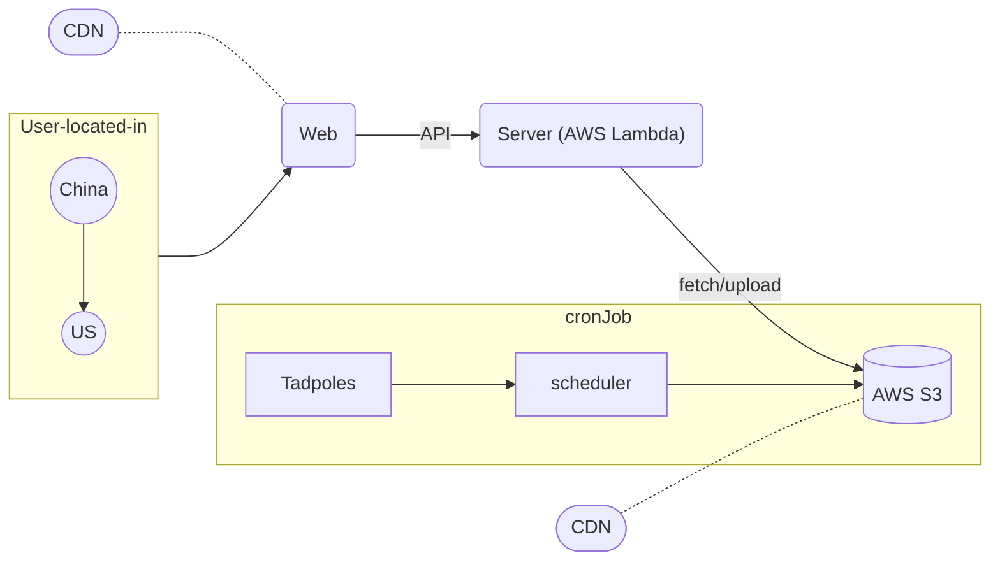

# Personal Photo Gallery with AWS s3

This is a project to host my the photos in a web app. It heavily utilizes aws resources like s3, lambda, cloudfront. There is also a [cron job](/cronjob) that you can opt in, which I use to auto upload my kid's photos from Tadpoles.

## Background & Motivations

It is difficult to share photos between US (where my kid & I live) and the grandparents (in China). Although I can send them one by one via chat app like Wechat, or use existing cloud service like Baidu, it is hard to display the photos properly.

There are other problems like the storage may be unreliable, the loading time may vary denpends on what location the photo is served from, it is hard to set up a scheduled service to upload photos automatically (e.g. from Tadpoles), and you may need to share the credentials if using a 3rd-party service.

## Architecture

## Components

[Web app](/app)

[Server](/server/)

[Cron job](/cronjob)

## Remain Problems
- [x] schedule pushing photos from Tadpoles
- [x] How to upload .HEIC file?
- [ ] video segation for fast loading time
- [x] How to load photos by pagination (UI)?
- [ ] auto refresh list after upload
- [ ] rate limiting
- [ ] Content-Language (CN) auto switch
- [ ] how to retrieve private photos by not using pre-signed URL? Using [Signed Cookies](https://docs.aws.amazon.com/AmazonCloudFront/latest/DeveloperGuide/private-content-signed-cookies.html) looks a better choice.
- [x] Maybe better to use [a docker container of AWS lambda](https://aws.amazon.com/blogs/compute/using-container-image-support-for-aws-lambda-with-aws-sam/) to replace Makefile build

# Reference
- [S3 presigned URLs with SAM](https://github.com/aws-samples/amazon-s3-presigned-urls-aws-sam)
- [Use an Amazon CloudFront distribution to serve a static website](https://docs.aws.amazon.com/Route53/latest/DeveloperGuide/getting-started-cloudfront-overview.html)
- [Using high-level (s3) commands with the AWS CLI](https://docs.aws.amazon.com/cli/latest/userguide/cli-services-s3-commands.html)
- [@aws-sdk/cloudfront-signer](https://github.com/aws/aws-sdk-js-v3/tree/main/packages/cloudfront-signer)
- [AWS SAM template anatomy](https://docs.aws.amazon.com/serverless-application-model/latest/developerguide/sam-specification-template-anatomy.html)
- [Protecting your API using Amazon API Gateway and AWS WAF](https://aws.amazon.com/blogs/compute/protecting-your-api-using-amazon-api-gateway-and-aws-waf-part-i/)